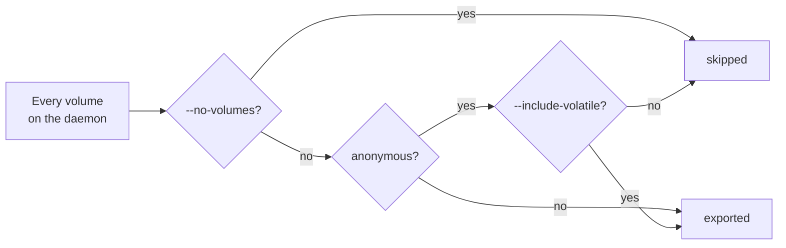
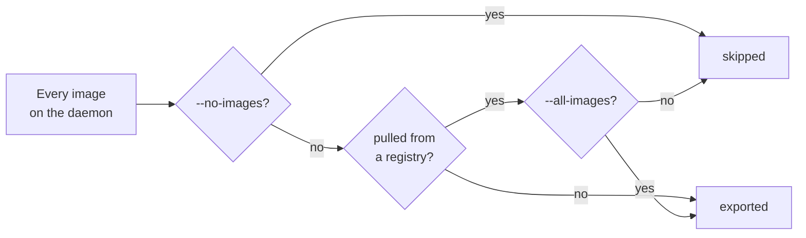

# How to back up

```text
docker-backup backup [OUTPUT] [--all-images] [--include-volatile]
                     [--containers NAME]... [--per-file-bzip2 | --single-archive]
                     [--no-images] [--no-volumes]
```

`OUTPUT` defaults to `./docker-backup-<UTC timestamp>`, for example
`docker-backup-20260920T091244Z`.

## What gets captured by default

Running `docker-backup backup ./my-backup` with no other flags captures:

- **every named volume**, and
- **every locally built image**.

It does not capture anonymous volumes, images pulled from a registry, or any
container filesystem. Those are opt-in, and the reasoning is the same in each
case: a backup should hold the things you cannot get back any other way.

**Volumes**



**Images**



Containers are the simple case: a container's filesystem is exported when you
name it with `--containers`, and never otherwise.

### How "locally built" is decided

An image counts as **pulled** when `docker image inspect` reports a non-empty
`Identity.Pull` array. Everything else — built from a Dockerfile, imported from
a tarball, or created by a daemon too old to record the field — counts as
**built**, and is therefore included by default.

The bias is deliberate. Wrongly treating a pulled image as built costs you disk
space; wrongly treating a built image as pulled costs you the image.

### How "anonymous" is decided

A volume is anonymous — the tool calls these *volatile* — when Docker has
labelled it `com.docker.volume.anonymous`, or when its name is the 64-character
hexadecimal id Docker generates for unnamed volumes. These are the volumes
created implicitly by a `VOLUME` instruction or a bare `-v /path` mount, and
they are usually scratch space that will be recreated on the next `docker run`.

If yours are not scratch space, pass `--include-volatile`.

## Choosing what to include

| Flag | Effect |
| --- | --- |
| `--all-images` | also export images pulled from a registry |
| `--include-volatile` | also export anonymous volumes |
| `--containers NAME` | export this container's whole filesystem |
| `--no-images` | export no images at all |
| `--no-volumes` | export no volumes at all |

`--containers` may be repeated or given a comma-separated list; both of these
are the same thing:

```bash
docker-backup backup ./my-backup --containers web --containers db
docker-backup backup ./my-backup --containers web,db
```

!!! note "A container filesystem is not its volumes"

    `--containers` captures the container's own writable layer, the way
    `docker export` does. Anything on a mounted volume is *not* part of it —
    that data comes from the volume export instead. Exporting both is the
    normal case, and it is what the default volume selection already does for
    you.

### Useful combinations

```bash
# Just the data. No images at all — you will rebuild or re-pull them.
docker-backup backup ./data-only --no-images

# Everything, including what a registry could give you back.
docker-backup backup ./everything --all-images --include-volatile

# Data plus one container's filesystem, as one compressed file.
docker-backup backup ./stack --containers web --single-archive
```

## Compression

Three shapes, and they are mutually exclusive in the ways that matter:

| Mode | Result | Needs `bzip2` |
| --- | --- | --- |
| *(default)* | folder of uncompressed `.tar` files | no |
| `--per-file-bzip2` | folder of `.tar.bz2` files | yes |
| `--single-archive` | one `<output>.tar.bz2` holding the whole folder | yes |

`--per-file-bzip2` and `--single-archive` cannot be combined; the parser rejects
that up front.

Which to choose:

- **Default** when the backup stays on the same disk, or when the filesystem
  already compresses. It is much the fastest.
- **`--per-file-bzip2`** when you want a browsable folder that is also small, or
  when you may want to restore selectively by hand later.
- **`--single-archive`** when the backup is about to be copied somewhere. One
  file is far easier to move, checksum and store than a directory tree.

bzip2 is slow. On a multi-gigabyte volume the compression, not the daemon, will
be the thing you are waiting for.

## Where the output goes

`docker-backup` refuses to write where a backup already lives. An output folder
that already holds a `manifest.json` — or, for `--single-archive`, an existing
`<output>.tar.bz2` — is an error:

```text
./my-backup already contains a backup; choose another output
```

That exits `2` and writes nothing. Mixing two backups in one folder would
produce a manifest that disagreed with the files beside it, so the tool declines
rather than guessing which one you meant.

## What you end up with

```text
my-backup/manifest.json
my-backup/volumes/<name>.tar[.bz2]
my-backup/images/<ref>.tar[.bz2]
my-backup/containers/<name>.tar[.bz2]
```

### The manifest

`manifest.json` is the index and the integrity record. Abridged:

```json
{
  "schema_version": 1,
  "created_at": "2026-09-20T09:12:44Z",
  "tool": { "name": "docker-backup", "version": "0.2.0" },
  "docker": {
    "server_version": "29.5.2",
    "client_version": "29.8.1",
    "host": "unix:///var/run/docker.sock",
    "context": "default",
    "os": "linux",
    "arch": "arm64"
  },
  "compression": "bzip2-per-file",
  "hash_algorithm": "sha256",
  "volumes": [
    {
      "name": "pgdata",
      "file": "volumes/pgdata.tar.bz2",
      "size_bytes": 20481024,
      "sha256": "6f1c…",
      "volatile": false,
      "inspect": { }
    }
  ],
  "images": [
    {
      "ref": "api:latest",
      "id": "sha256:1a2b…",
      "file": "images/api_latest.tar.bz2",
      "size_bytes": 88129536,
      "sha256": "9d0e…",
      "origin": "built",
      "platform": { "os": "linux", "arch": "arm64" },
      "inspect": { }
    }
  ],
  "containers": []
}
```

Three parts of it do real work later:

- **`sha256` per file** — checked by `info`, and by `restore` before it touches
  the daemon.
- **`docker.os` / `docker.arch`** — the platform of the daemon that produced the
  backup, compared against the target at restore time.
- **`platform` per image and container** — what that specific image was built
  for, which is what actually decides whether it is skipped.

The `inspect` blocks hold the raw `docker inspect` output for each item. Nothing
in the restore path reads them; they are there so you can reconstruct settings
the tool does not restore, such as networks, port bindings and environment.

!!! note "Older backups"

    `platform` was added in 0.2.0. A manifest written by 0.1.0 has no platform
    information, and a restore treats it as unknown rather than as a mismatch —
    nothing is skipped on its account.

## Check it before you trust it

```bash
docker-backup info ./my-backup
```

`info` re-reads the manifest and verifies every recorded hash. It is the only
cheap way to find out that a backup went bad, and the expensive way to find out
is during a restore you needed to work.

For an archive, point it at the file directly:

```bash
docker-backup info ./my-backup.tar.bz2
```

The archive is unpacked into a temporary directory beside itself, so that
filesystem needs roughly twice the archive's size free.

## Before you back up stateful services

!!! warning "Volumes are read live"

    Nothing is stopped or paused. A database writing to its volume while that
    volume is being tarred can produce a backup that passes every hash check and
    still will not start — the tar is a faithful copy of an inconsistent moment.

    Either stop the container first:

    ```bash
    docker stop postgres
    docker-backup backup ./my-backup
    docker start postgres
    ```

    or dump that data with the database's own tooling and let `docker-backup`
    take everything else.

## Scripting

```bash
docker-backup --json backup ./my-backup --per-file-bzip2 > report.json
```

With `--json`, one JSON document goes to stdout and progress stays on stderr, so
redirecting stdout gives you a clean report. Exit code `0` means every item
succeeded; `1` means the backup was written but at least one item failed, and
the report says which.
