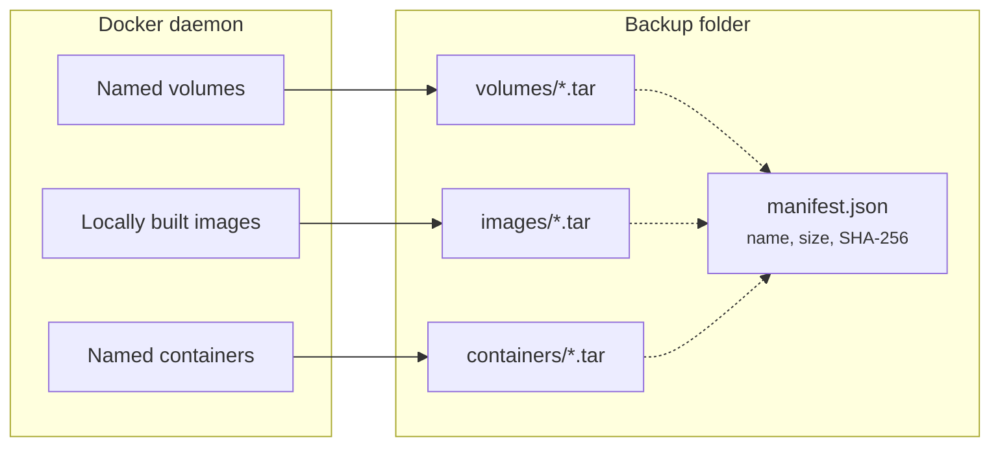

# Introduction

`docker-backup` exports the data living inside a Docker daemon — named volumes,
locally built images, and whole container filesystems — into one ordinary
folder, and loads that folder back into a daemon later.

It is a coordinator, not a daemon and not a service. Every operation it
performs is one you could perform yourself with `docker`, `tar` and patience;
the tool's job is to perform them consistently, record exactly what it captured,
and refuse to do anything destructive without telling you first.

## The problem it solves

A Docker volume is not a folder you can casually copy. It lives inside the
daemon's data root, which on macOS and Windows is inside a virtual machine you
do not ordinarily mount. File-level backup tools either miss volumes entirely or
copy them from underneath a running container.

Doing it by hand works, but it is a lot of ceremony to repeat correctly:

```bash
# For every volume…
docker run --rm -v pgdata:/data -v "$PWD":/out alpine:3 tar -C /data -cf /out/pgdata.tar .
# For every image you built rather than pulled…
docker save -o api.tar api:latest
# And then keep notes about which of these belong together.
```

Miss a volume and you discover it during the restore, which is the worst
possible time. `docker-backup` captures the set in one pass and writes down what
it captured.

## What a backup looks like



The result is a plain directory:

```text
my-backup/manifest.json
my-backup/volumes/pgdata.tar
my-backup/images/api_latest.tar
my-backup/containers/web.tar
```

Nothing is in a proprietary container. The `.tar` files are the same ones
`docker save` and `tar` produce, so a volume can be restored by hand if this
tool is ever unavailable:

```bash
docker volume create pgdata
docker run --rm -i -v pgdata:/data alpine:3 tar -C /data -xf - < volumes/pgdata.tar
```

That is a deliberate design constraint rather than a happy accident. A backup
you cannot open without a specific version of a specific tool is a backup with a
dependency you did not intend to take.

## What it checks for you

**Integrity.** Every file's SHA-256 is recorded in the manifest when the backup
is written, and verified before a restore touches the daemon. A truncated
download or a bad disk fails the restore instead of half-loading it.

**Architecture.** The manifest records the os/arch of the daemon that produced
the backup, and the platform of every image in it. Restoring an `amd64` backup
onto an `arm64` daemon is a real situation — moving from an Intel Mac to Apple
Silicon, or from a laptop to a cloud host — and images built for the wrong
architecture will not run. `docker-backup` detects the mismatch, shows you which
items are affected, and skips them unless you explicitly insist.

**Intent.** `restore` prints a preview of everything it is about to do and waits
for confirmation before making a single change.

## What it is not

!!! info "Deliberate omissions"

    - **Not a scheduler.** It runs when you run it. Use cron, systemd timers, or
      whatever you already trust.
    - **Not incremental.** Every backup is a full one. There is no deduplication
      and no chain of dependent snapshots to keep intact.
    - **Not a registry.** Images are `docker save` tarballs, not pushed
      artefacts.
    - **Not encrypted.** If the contents are sensitive, encrypt the folder or
      archive yourself.

## One caveat worth reading twice

!!! warning "Backups are taken live"

    `docker-backup` does not stop or pause containers before reading their
    volumes. A database that is actively writing while its volume is tarred can
    produce a backup that is byte-complete but logically torn — the same result
    you would get by copying a database's files out from under it.

    For stateful services, either stop the container first, or use the
    database's own dump mechanism for that data and let `docker-backup` handle
    everything else.

## Where to go next

- **[Installation](install.md)** — download a signed release or build from
  source, and confirm the daemon is reachable.
- **[Quickstart](quickstart.md)** — the full round trip in five commands.
- **[How to back up](backup.md)** — what gets captured by default, and how to
  change it.
- **[How to restore](restore.md)** — the preview, the confirmations, the
  architecture check, and `--overwrite`.

## Licence

`docker-backup` is free software under the GNU General Public Licence, version 3
or later. It comes with absolutely no warranty.
