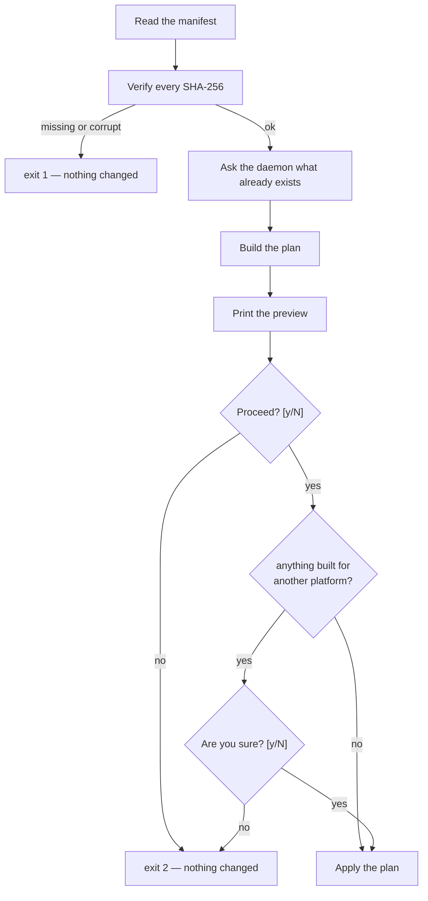

# How to restore

```text
docker-backup restore <SOURCE> [--overwrite] [--include-volatile]
                      [--container-tag TAG] [--no-images] [--no-volumes]
                      [--no-containers] [--skip-verify] [--yes | -y]
                      [--force-import-if-arch-mismatch]
```

`SOURCE` is either a backup folder or a `.tar.bz2` produced by
`--single-archive`. An archive is unpacked into a temporary directory beside
itself, which needs roughly twice its size free.

## What happens, in order

Restore is deliberately front-loaded: everything that can fail cheaply happens
before anything is changed.



By the time the first volume is touched, the hashes have been checked, the
daemon has been asked what it already holds, and you have agreed to a plan that
was printed in full.

## The preview

```text
Restore preview
┌─────────────────┬────────────────────────────────────────┐
│ Source          ┆ ./my-backup                            │
│ Created at      ┆ 2026-09-20T09:12:44Z                   │
│ Backup platform ┆ linux/arm64                            │
│ Target platform ┆ linux/arm64                            │
│ Volumes         ┆ 3 to create, 0 to overwrite, 1 skipped │
│ Images          ┆ 2 to load                              │
│ Containers      ┆ 0 to import                            │
│ Overwrite       ┆ off                                    │
└─────────────────┴────────────────────────────────────────┘
Proceed? [y/N]
```

Only `y` or `yes` continues. Anything else — including an empty line — exits `2`
with `aborted: cancelled by user`, having changed nothing.

The preview goes to **stderr**, not stdout, so it stays visible when you
redirect a report to a file.

## Volumes

| Situation | Default | With `--overwrite` |
| --- | --- | --- |
| volume does not exist | created and filled | created and filled |
| volume already exists | **left alone** | **emptied and refilled** |
| volume is anonymous | skipped unless `--include-volatile` | same |

The default is conservative on purpose. A restore that only ever creates missing
volumes cannot destroy data you still wanted, which makes it safe to run against
a live host to fill in the gaps.

### Replacing existing volumes { #overwrite }

!!! danger "`--overwrite` is not selective"

    `--overwrite` empties and refills **every** volume named in the manifest
    that already exists on the host — not just the one you were thinking of.

    If the backup holds twelve volumes and the host already has eight of them,
    all eight are wiped and reloaded from the backup. Any data written to them
    since the backup was taken is gone.

    Check what a backup actually contains before reaching for it:

    ```bash
    docker-backup info ./my-backup
    ```

    And look at the `Volumes` row of the preview, which tells you the count
    before you answer the prompt.

Volumes are also emptied *before* the data is streamed in, which matters if a
restore fails partway — see [below](#when-a-restore-fails-partway).

## Images

Images are loaded with `docker load`, so they arrive under the tags they had
when the backup was taken. An image already present on the host is simply
replaced by the loaded one, which is Docker's own behaviour rather than
something this tool decides.

Pass `--no-images` to skip them entirely — useful when you only want the data
and intend to rebuild.

## Container filesystems

A container exported with `--containers` comes back as an **image**, not as a
running container. It is imported as:

```text
<container name>:<tag>
```

where the tag defaults to `restored`. So a container named `web` becomes the
image `web:restored`, which you then run however you like.

The name is lowercased on the way in, because Docker accepts uppercase in
container names but rejects it in image references. A container named `WebApp`
becomes `webapp:restored`.

Change the tag with `--container-tag`:

```bash
docker-backup restore ./my-backup --container-tag from-2026-09-20
# → web:from-2026-09-20
```

`--no-containers` skips them.

## The architecture check { #the-architecture-check }

An image built for `linux/amd64` will not run on a `linux/arm64` daemon. This is
the ordinary situation when moving between an Intel machine and Apple Silicon,
or between a laptop and a cloud host — and it used to be discovered at
`docker run` time, long after the restore appeared to succeed.

`docker-backup` compares the platform recorded for each image and container
against the daemon it is restoring into. Comparison is case-insensitive on
os and arch; the variant (`v7`, `v8`, …) is ignored.

When they differ, the preview marks it and a second confirmation appears:

```text
Restore preview
┌─────────────────┬────────────────────────────────────────┐
│ Source          ┆ ./my-backup                            │
│ Created at      ┆ 2026-09-20T09:12:44Z                   │
│ Backup platform ┆ linux/amd64                            │
│ Target platform ┆ linux/arm64 (mismatch)                 │
│ Volumes         ┆ 3 to create, 0 to overwrite, 1 skipped │
│ Images          ┆ 2 to load                              │
│ Containers      ┆ 1 to import                            │
│ Overwrite       ┆ off                                    │
└─────────────────┴────────────────────────────────────────┘
Proceed? [y/N] y
Architecture mismatch
┌──────────────────────────────────────────────────────────────────────────────────────────────────────┐
│ 3 item(s) were built for another platform than this daemon (linux/arm64):                            │
│   image api:latest  (linux/amd64)                                                                    │
│   image worker:latest  (linux/amd64)                                                                 │
│   container web  (linux/amd64)                                                                       │
│ 3 image(s)/container(s) will be skipped. Pass --force-import-if-arch-mismatch to import them anyway. │
└──────────────────────────────────────────────────────────────────────────────────────────────────────┘
Are you sure? [y/N]
```

Answering `y` continues the restore **with those items skipped**. Volumes are
unaffected — data has no architecture — so the usual outcome is that all your
data arrives and the images do not.

Each skipped item is reported as a failure, so the run exits `1` even though
everything else worked. That is intentional: a restore that silently dropped
your images and exited `0` would be worse.

### Importing them anyway

```bash
docker-backup restore ./my-backup --force-import-if-arch-mismatch
```

The items are imported unchanged. They may still fail to run, but there are good
reasons to want them: emulation via QEMU or Rosetta, a multi-architecture image
whose metadata is misleading, or simply wanting the layers on disk to inspect.

### When the platform is unknown

Backups written before 0.2.0 carry no platform information. Those items are
treated as **unknown**, not as a mismatch: the preview shows `unknown`, nothing
is skipped, and no second prompt appears. An old backup restores exactly as it
did before the check existed.

## Restoring without a terminal

The prompts need a terminal. Without one — in a script, behind a pipe, or
whenever `--json` is used — `restore` refuses rather than assuming consent:

```text
aborted: not running interactively (--json or stdin is not a terminal);
pass --yes to restore without confirmation
```

That is exit code `2`, and nothing has been changed. Pass `--yes` (or `-y`) to
answer both prompts up front:

```bash
docker-backup --json restore ./my-backup --yes > report.json
```

!!! warning "`--yes` also answers the architecture prompt"

    One flag covers both confirmations. In an automated restore, arrange to read
    the exit code and the report rather than assuming success — a `1` may mean
    every image was skipped for the wrong architecture.

## Restoring only part of a backup

| Flag | Effect |
| --- | --- |
| `--no-volumes` | do not touch volumes |
| `--no-images` | do not load images |
| `--no-containers` | do not import container filesystems |
| `--include-volatile` | also restore anonymous volumes |

```bash
# Images only, onto a machine whose data is already current.
docker-backup restore ./my-backup --no-volumes --no-containers
```

## Verification

Every file's SHA-256 is checked before the daemon is touched. If any file is
missing or corrupt the restore stops with exit `1` and changes nothing:

```text
backup verification failed: 0 missing, 1 corrupt
```

`--skip-verify` bypasses the check. It exists for large backups on storage you
already trust, and it trades away the one guarantee that a restore is working
from intact data. Prefer running `docker-backup info` once and keeping the
check.

## When a restore fails partway { #when-a-restore-fails-partway }

A volume is created — and with `--overwrite`, emptied — *before* its data is
streamed in. If the stream fails midway, that volume is left half-restored.

The recovery is to run the restore again with `--overwrite`, which empties and
refills it from the backup:

```bash
docker-backup restore ./my-backup --overwrite
```

Re-read the [`--overwrite` warning](#overwrite) first: this also rewrites every
other volume in the manifest that exists on the host.

Per-item results are listed at the end of every run, so you can see exactly
which items succeeded, which were skipped, and why.

## Exit codes

| Code | Meaning |
| --- | --- |
| `0` | everything restored |
| `1` | some items failed, were skipped for architecture, or verification failed |
| `2` | usage error, or declined at a prompt |
| `3` | docker unavailable, or a required tool is missing |
